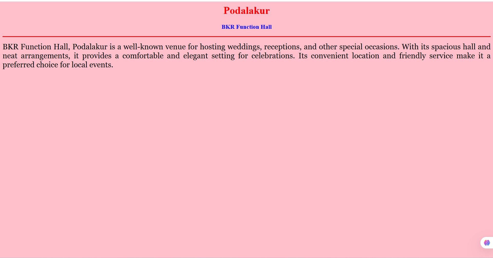
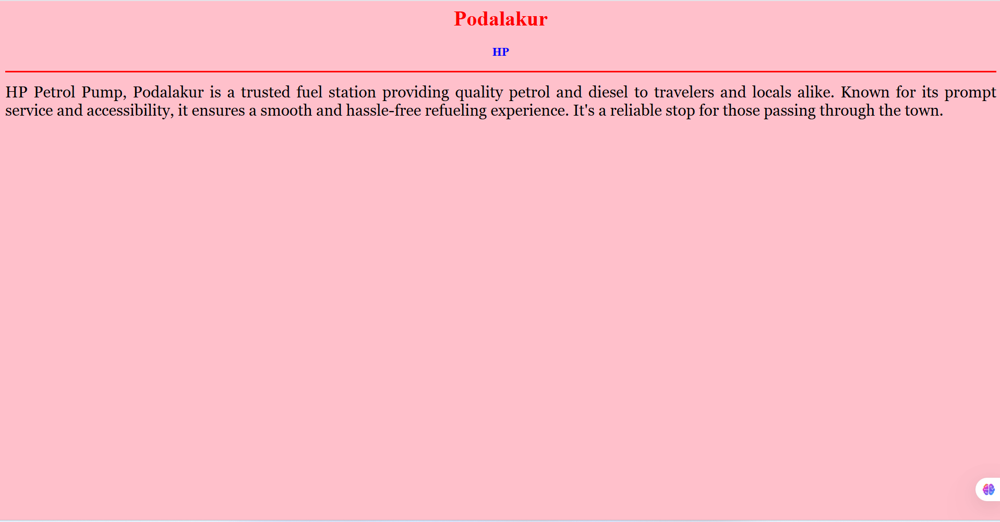
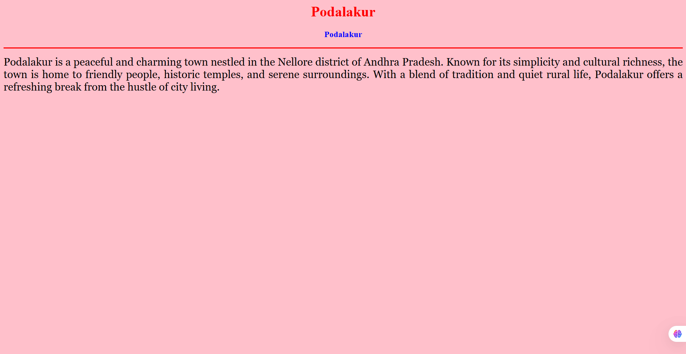

# Ex04 Places Around Me
## Date: 26/04/2025

## AIM
To develop a website to display details about the places around my house.

## DESIGN STEPS

### STEP 1
Create a Django admin interface.

### STEP 2
Download your city map from Google.

### STEP 3
Using ```<map>``` tag name the map.

### STEP 4
Create clickable regions in the image using ```<area>``` tag.

### STEP 5
Write HTML programs for all the regions identified.

### STEP 6
Execute the programs and publish them.

## CODE
```
map.html

<html>
<head>
<title>My City</title>
</head>
<body>
<h1 align="center">
<font color="red"><b>Podalakur
</b></font>
</h1>
<h3 align="center">
<font color="blue"><b> Junjar (212224230110)</b></font>
</h3>
<center>

<map name="MyCity">
  <area shape="rect" coords="158,46,135,40" href="sivalayam.html" title="Sivalayam">
  <area shape="circle" coords="945,47,85,35" href="HP.html" title="HP petrol pump">
  <area shape="circle" coords="1005,81,115,30" href="JamunaC.html" title="Jamuna Cinemas">
  <area shape="circle" coords="792,232,100,40" href="Podalakur.html" title="Podalakur">
  <area shape="rect" coords="583,464,130,35" href="BKR.html" title="BKR Function Hall">
</map>
</center>
</body>
</html>

BKR.html

<html>
<head>
<title>My Home Town</title>
</head>
<body bgcolor="pink">
<h1 align="center">
<font color="red"><b>Podalakur</b></font>
</h1>
<h3 align="center">
<font color="blue"><b>BKR Function Hall</b></font>
</h3>
<hr size="3" color="red">
<p align="justify">
<font face="Georgia" size="5">
    BKR Function Hall, Podalakur is a well-known venue for hosting weddings, receptions, and other special occasions. With its spacious hall and neat arrangements, it provides a comfortable and elegant setting for celebrations. Its convenient location and friendly service make it a preferred choice for local events.</font>

</p>
</body>
</html>

HP.html

<html>
<head>
<title>My Home Town</title>
</head>
<body bgcolor="pink">
<h1 align="center">
<font color="red"><b>Podalakur</b></font>
</h1>
<h3 align="center">
<font color="blue"><b>HP</b></font>
</h3>
<hr size="3" color="red">
<p align="justify">
<font face="Georgia" size="5">
    HP Petrol Pump, Podalakur is a trusted fuel station providing quality petrol and diesel to travelers and locals alike. Known for its prompt service and accessibility, it ensures a smooth and hassle-free refueling experience. It's a reliable stop for those passing through the town.</font>

</font>

</p>
</body>
</html>

Podalakur.html

<html>
<head>
<title>My Home Town</title>
</head>
<body bgcolor="pink">
<h1 align="center">
<font color="red"><b>Podalakur</b></font>
</h1>
<h3 align="center">
<font color="blue"><b>Podalakur</b></font>
</h3>
<hr size="3" color="red">
<p align="justify">
<font face="Georgia" size="5">
    Podalakur is a peaceful and charming town nestled in the Nellore district of Andhra Pradesh. Known for its simplicity and cultural richness, the town is home to friendly people, historic temples, and serene surroundings. With a blend of tradition and quiet rural life, Podalakur offers a refreshing break from the hustle of city living.</font>

</font>

</p>
</body>
</html>

```
## OUTPUT









## RESULT
The program for implementing image maps using HTML is executed successfully.
